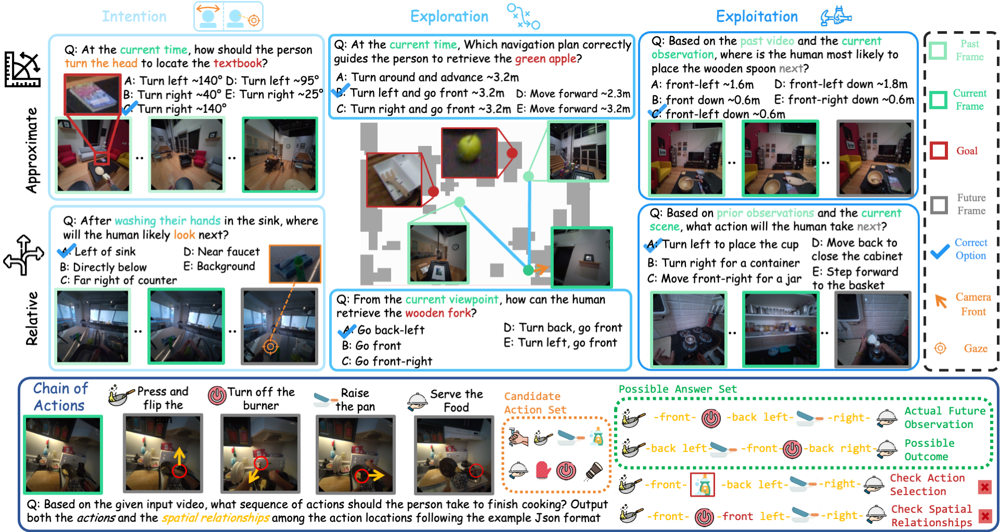
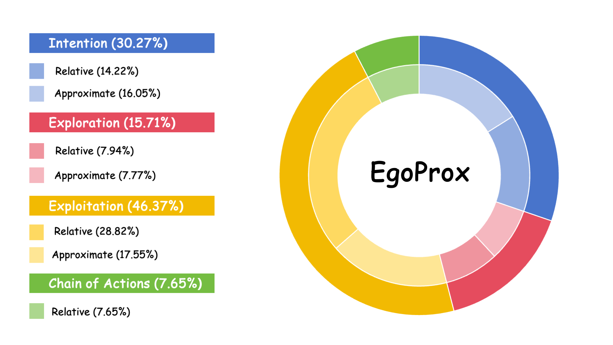

<h1 align="center">
  EgoProx: Evaluating MLLMs on Egocentric 3D Proximity Reasoning Across a Cognitive Hierarchy
</h1>

<p align="center">
  🔥🔥 EgoProx is accepted by CVPR 2026! 🔥🔥
</p>

<p align="center">
  <a href="#" style="margin-right: 10px;"> 
    
  </a>
  <a href="https://lijinzhao30.github.io/Egoprox/" style="margin-right: 10px;"> 
    
  </a>
  <a href="https://huggingface.co/datasets/lijinzhao30/EgoProx" style="margin-right: 10px;"> 
    
  </a>
</p>

## Introduction

EgoProx is a comprehensive benchmark designed to evaluate multimodal large language models (MLLMs) on complex egocentric 3D proximity reasoning tasks. The benchmark spans four core dimensions following a cognitive hierarchy: Intention, Exploration, Exploitation, and Chain of Actions. It adopts approximate distance estimation and relative spatial relationships to represent proximity. The examples illustrate the model’s need to interpret long-term contextual cues, spatial dependencies, and action-state changes from first-person visual inputs, providing a comprehensive assessment of egocentric spatial intelligence.

<p align="center">
  
</p>

## Dataset Statistics

EgoProx is a benchmark for evaluating egocentric 3D proximity reasoning in multimodal large language models. It contains 2,405 VQA samples collected from two complementary egocentric datasets: 1,016 samples from Aria Digital Twin (ADT) and 1,389 samples from EgoExo4D. The benchmark covers a broad spectrum of proximity reasoning scenarios and is organized according to a four-level cognitive hierarchy consisting of Intention (30.27%), Exploration (15.71%), Exploitation (46.37%), and Chain of Actions (7.65%).

<p align="center">
  
</p>

## Data Preparation

1. Clone the repository:
   ```bash
   git clone https://github.com/lijinzhao30/Egoprox.git
   cd Egoprox
   ```
2. Download `Frames.tar` from our [Hugging Face repository](https://huggingface.co/datasets/lijinzhao30/EgoProx).
3. Place the downloaded file at `data/Frames.tar`.
4. Extract the contents into the `data/Frames` directory:
   ```bash
   cd data/
   tar -xf Frames.tar
   ```

## Evaluation 

For evaluating models on EgoProx, we provide inference scripts demonstrating how to use both open-source and closed-source models. After getting the inference results, you can use `evaluate.py` to calculate the metrics.

### Open-source Models
For open-source models like the Qwen series, you can use the provided script `inference/infer_qwen.py`:
```bash
python inference/infer_qwen.py \
  --model_path <path_to_qwen_model> \
  --input_json data/egoprox_test.json \
  --output_json <path_to_output_json> \
  --image_base_dir data/Frames \
  --batch_size 16
```

### Closed-source Models
For closed-source API models like the GPT series, you can use `inference/infer_gpt.py`:
```bash
python inference/infer_gpt.py \
  --input_json data/egoprox_test.json \
  --output_json <path_to_output_json> \
  --image_base_dir data/Frames \
  --base_url <your_base_url> \
  --api_version <your_api_version> \
  --api_key <your_api_key> \
  --model_name <your_model_name> \
  --max_workers 16
```

### Scoring

After running the inference scripts, you will get an output JSON file containing the model's predictions. Use the `evaluate.py` script to compute the final metrics:

```bash
python evaluate.py --path <path_to_output_json>
```

This will print out the accuracy (ACC) for each of the core dimensions (Intention, Exploration, Exploitation) under both Approx and Relative settings, as well as the specialized metrics (Act-Acc, Rel-Acc-S, Rel-Acc-L) for the Chain of Actions task.

## License

EgoProx is released under the `CC BY-NC 4.0` license. By downloading our dataset, the user agrees to adhere to the terms of this license.

## 📍 Citing EgoProx
```bibtex
```